# JKC Cafe

[](http://cafedemotempsite.infinityfree.io/)


[](LICENSE)


JKC Cafe is a full-stack cafe ordering portfolio project built with PHP and MySQL/MariaDB. It includes a customer-facing storefront for browsing products and placing demo orders, plus an admin dashboard for managing menu items, orders, users, and customer messages.

> **Portfolio Project:** This application is intended for demonstration and educational purposes. Payment and recovery workflows are simulated.

## 🚀 Latest Release

Current Version: **v1.1.0**

Major additions include:

- CSRF protection
- Session hardening
- Secure POST logout
- Shared password policy
- Session-based rate limiting
- Admin authorization refresh
- Transactional admin safeguards
- Expanded Playwright security testing

## 📊 Project Snapshot

- 18 customer-facing PHP routes
- 13 admin PHP routes
- Responsive interface tested from 320px to 1440px
- Automated Playwright regression suite
- Security/auth hardening through v1.1.0
- Live demo deployment
- MIT licensed

## 📈 Repository Statistics

- ~40 PHP files
- 18 customer routes
- 13 admin routes
- Responsive from 320px–1440px
- 27+ automated Playwright tests
- MIT License

## ✨ Highlights

- Full-stack PHP and MySQL/MariaDB cafe ordering application
- Customer storefront with menu browsing, cart, demo checkout, profile, rewards, and contact flows
- Admin dashboard for products, orders, users, customer messages, analytics, and settings
- Responsive UI verified across common viewport widths from 320px to 1440px
- Security/authentication hardening for CSRF, sessions, logout, password validation, rate limiting, and admin authorization
- Automated Playwright testing for smoke, responsive, and security/auth regression coverage
- Portfolio-ready documentation, screenshots, setup notes, and architecture notes
- Demo-friendly payment and password recovery workflows

## 📑 Table of Contents

- [Live Demo](#live-demo)
- [Latest Release](#-latest-release)
- [Project Snapshot](#-project-snapshot)
- [Highlights](#-highlights)
- [Screenshot Gallery](#screenshot-gallery)
- [Features](#features)
- [Tech Stack](#tech-stack)
- [Key Learnings](#-key-learnings)
- [Quick Start](#quick-start)
- [Local Setup](#local-setup)
- [Testing](#testing)
- [Deployment Notes](#deployment-notes)
- [Repository Structure](#repository-structure)
- [Application Architecture](#-application-architecture)
- [Design Principles](#design-principles)
- [Roadmap](#-roadmap)
- [Author](#author)

## Live Demo

Visit the public demo: [cafedemotempsite.infinityfree.io](http://cafedemotempsite.infinityfree.io/)

> The payment and password-recovery experiences are presentation-only demos. Do not enter real payment details or rely on this site for real transactions.

## Screenshot Gallery

All screenshots below were captured at a 1440×900 desktop layout using isolated demo data.

### Customer Experience

| Page | Preview |
| --- | --- |
| Homepage |  |
| Menu | 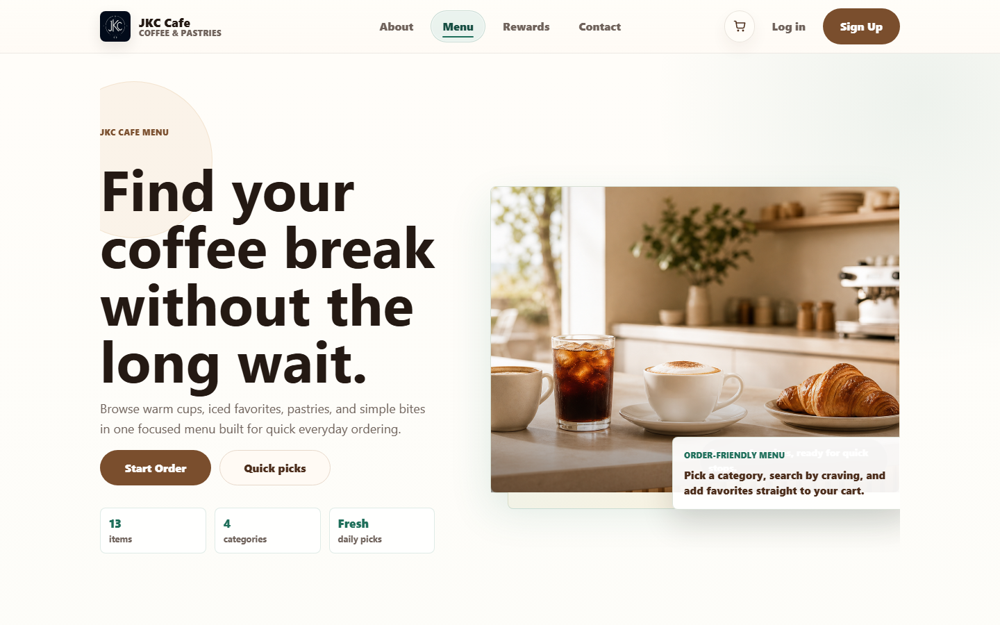 |
| Cart | 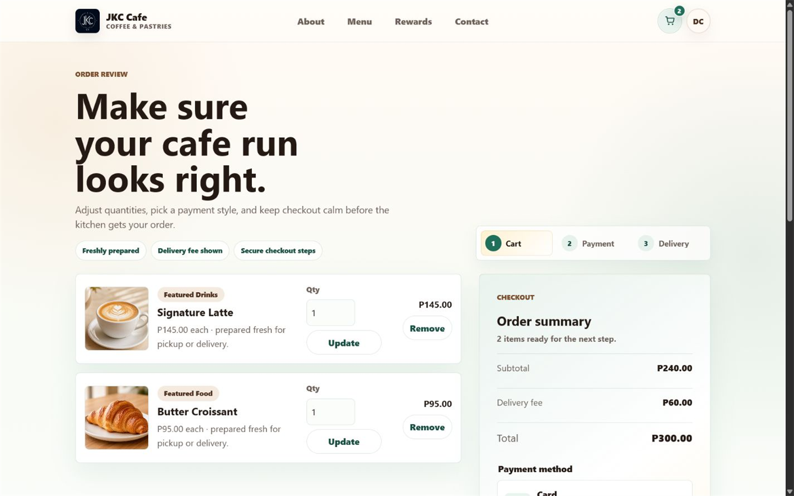 |
| Demo GCash checkout | 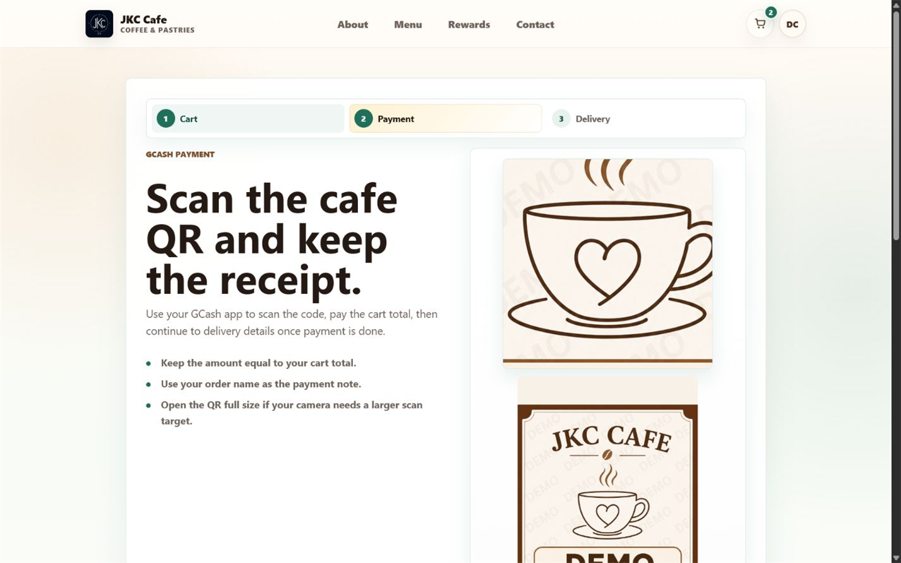 |
| Rewards | 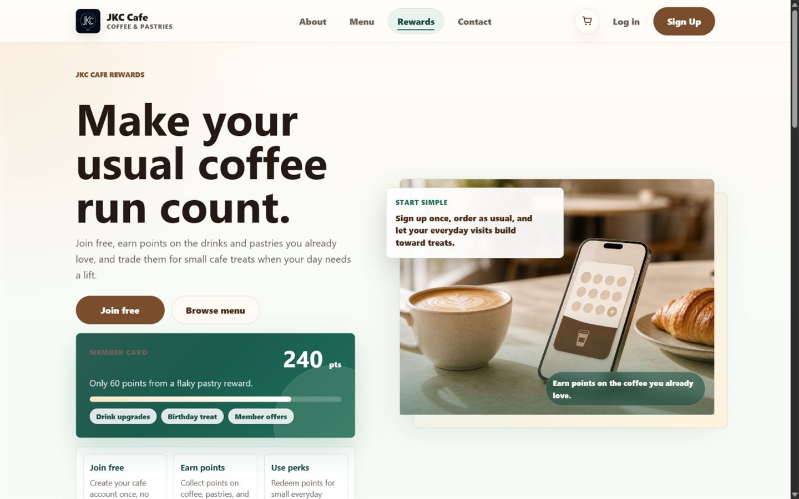 |
| Contact | 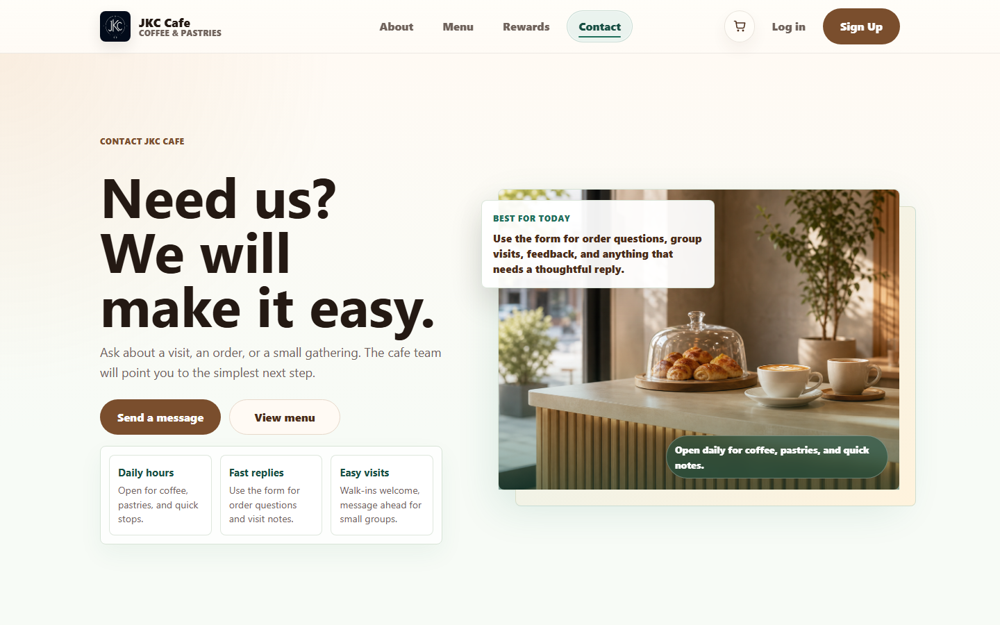 |
| User profile | 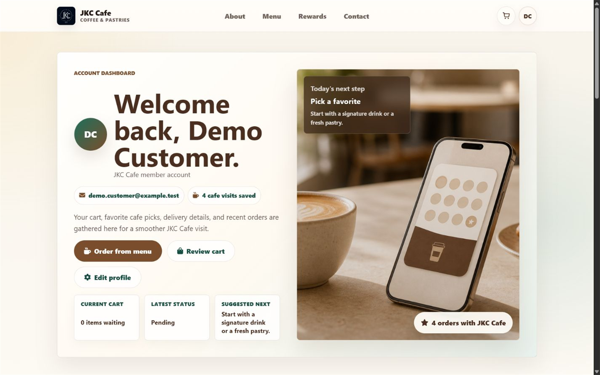 |

### Admin Workspace

| Page | Preview |
| --- | --- |
| Dashboard | 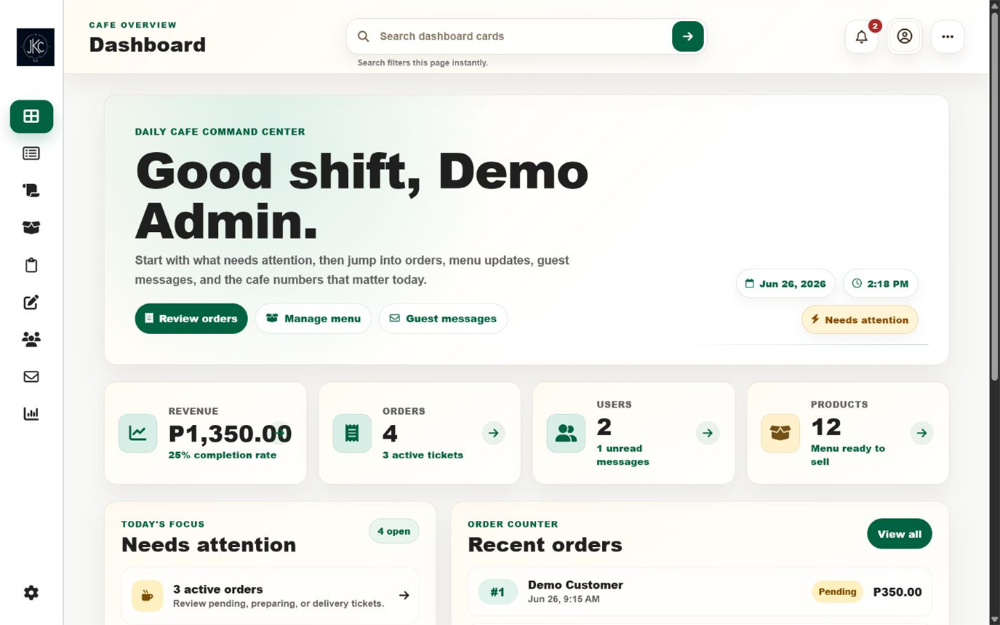 |
| Manage products | 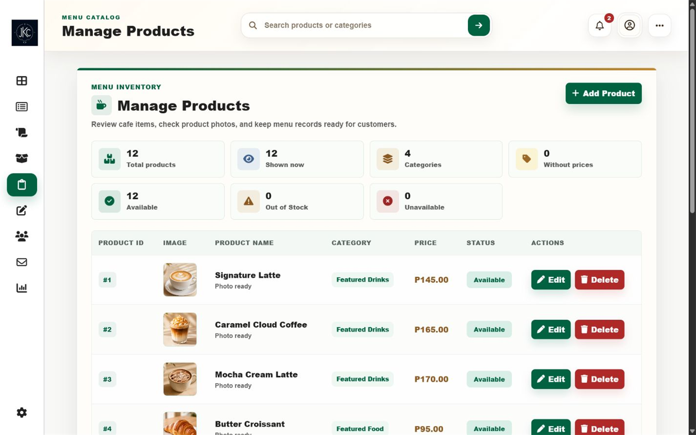 |
| Manage orders | 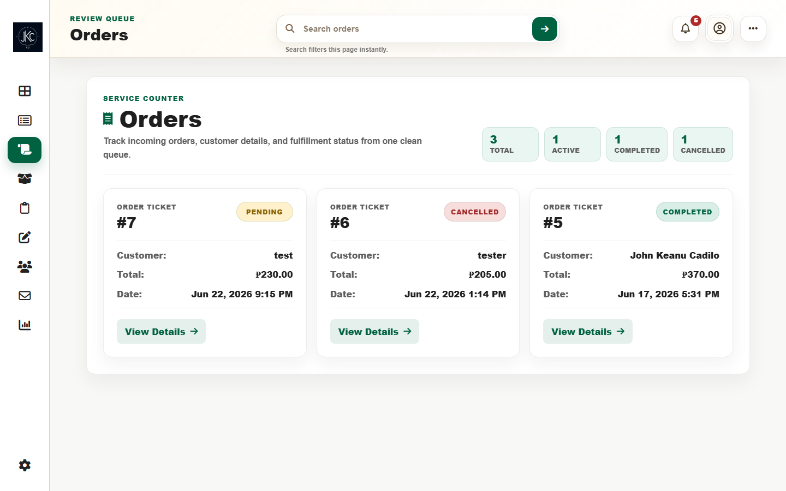 |
| Users | 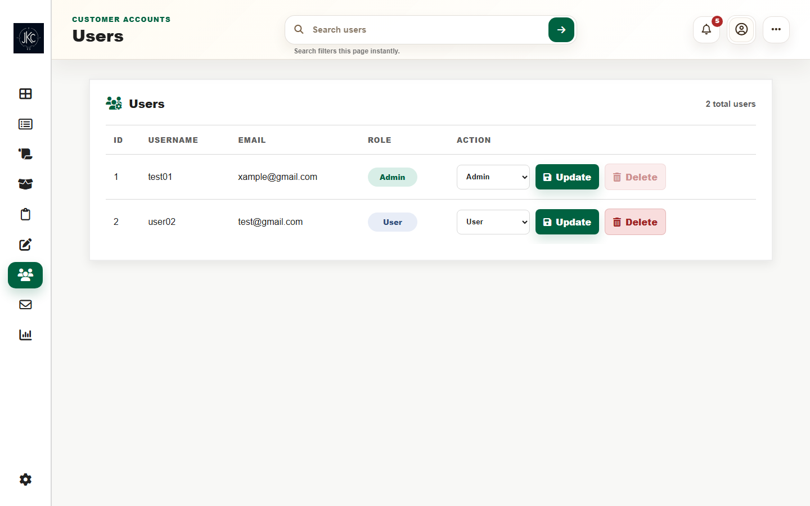 |
| Analytics | 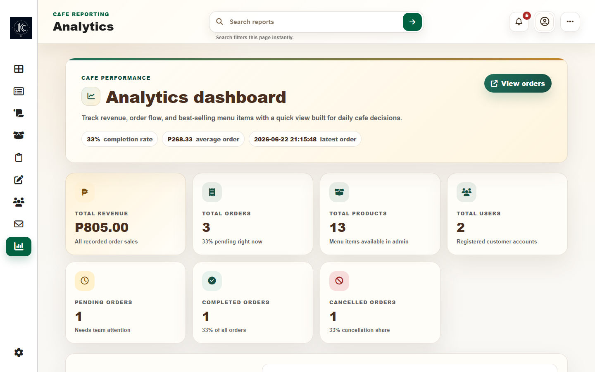 |
| Contact messages | 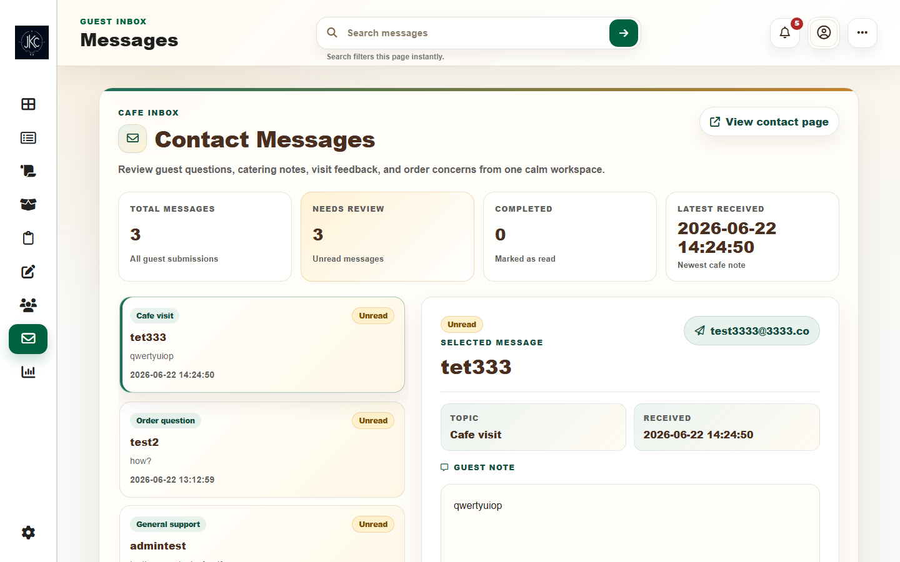 |
| Settings | 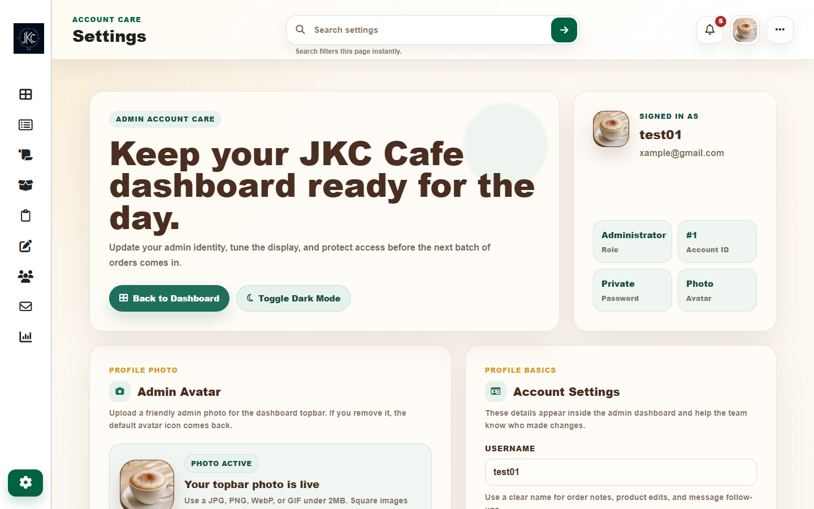 |

## Features

### Customer experience

- Responsive homepage, menu, about, rewards, and contact pages
- Mobile-responsive customer experience across storefront, account, cart, and checkout pages
- Responsive UI verified across common viewport sizes from 320px to 1440px
- Product search, category filtering, cart management, and order summary
- Account registration, login, profile, settings, and order tracking
- Demo checkout flows for cash on delivery, card, and GCash
- Product availability reminders and in-app notifications

### Admin experience

- Dashboard metrics and recent activity overview
- Responsive admin dashboard for desktop, tablet, and mobile workflows
- Mobile sidebar navigation for touch devices
- Responsive admin tables and forms for products, orders, users, and analytics
- Product creation, editing, availability updates, and image uploads
- Order status management and customer-message review
- User administration, admin profile, and account settings

## Tech Stack

**Backend**
- PHP 8.2+
- Shared PHP helper/bootstrap layer

**Frontend**
- HTML, CSS, and vanilla JavaScript
- Font Awesome 6 for admin interface icons

**Database**
- MySQL 8+ or MariaDB 10.4+

**Testing**
- Playwright for browser smoke and security/auth regression tests
- PHP syntax linting

**Deployment**
- InfinityFree for live demo hosting

**Development Tools**
- XAMPP for local Apache/MySQL development
- npm and Node.js for Playwright tooling

## 📚 Key Learnings

- Structuring PHP CRUD flows for products, orders, users, profiles, and messages
- Designing responsive customer and admin interfaces with shared and page-specific CSS
- Organizing modular CSS and vanilla JavaScript for navigation, filters, uploads, settings, and admin interactions
- Modeling relational data for users, products, orders, order items, notifications, and contact messages
- Using Playwright to smoke test browser flows and catch responsive regressions
- Applying CSRF protection, session hardening, session-based rate limiting, and admin authorization safeguards in PHP
- Debugging UI state issues around sticky navigation, drawer overlays, touch targets, and table/card layouts

## Quick Start

```text
Clone repository
        ↓
Copy config.example.php → config.local.php
        ↓
Import database/schema.sql
        ↓
Start Apache + MySQL
        ↓
Open http://localhost/Project/
```

For exact commands and local admin setup, follow the full Local Setup instructions below.

## Local Setup

### Prerequisites

- XAMPP with Apache, PHP, and MySQL/MariaDB enabled
- Node.js 20+ and npm for Playwright tests

### 1. Clone and configure

```powershell
git clone https://github.com/JKCadilo14-CpE/cafe-website-demo.git
cd cafe-website-demo
Copy-Item config.example.php config.local.php
```

Update `config.local.php` with your local database name and credentials. This file is intentionally ignored by Git and must never be committed.

### 2. Create and import the database

Create an empty database named `jkc_cafe` (or choose another name and use it in `config.local.php`):

```sql
CREATE DATABASE jkc_cafe CHARACTER SET utf8mb4 COLLATE utf8mb4_unicode_ci;
```

Import the sanitized schema and safe catalogue seed data:

```powershell
mysql -u root -p jkc_cafe < database/schema.sql
```

### 3. Start the application

Place the project under XAMPP's `htdocs` directory, start Apache and MySQL from the XAMPP Control Panel, then open:

```text
http://localhost/Project/
```

The application creates ignored upload directories under `uploads/` when an image is uploaded. Ensure the web server can write to that directory in your local environment.

### 4. Create a local admin account

1. Create a regular account through the sign-up page.
2. In your local database, promote that account deliberately:

```sql
UPDATE users
SET role = 1
WHERE email = 'your-email@example.com';
```

Sign out and back in to load the admin role.

## Testing

Install the JavaScript test dependencies:

```powershell
npm ci
npx playwright install
```

With Apache, MySQL, and the local database configured, run the Chromium smoke tests:

```powershell
$env:BASE_URL = 'http://localhost/Project/'
npx playwright test --project=chromium
```

The Playwright suite includes public-page smoke tests plus focused security/auth regression coverage for CSRF, logout, session cookies, rate limiting, password validation, and admin authorization behavior. Admin-only tests can be exercised by setting `ADMIN_EMAIL` and `ADMIN_PASSWORD` for a local admin account.

Run PHP syntax checks for all application files:

```powershell
Get-ChildItem -Recurse -Filter *.php | ForEach-Object { php -l $_.FullName }
```

## Deployment Notes

The live demo is hosted on InfinityFree. For a comparable deployment:

1. Create a MySQL/MariaDB database in the hosting dashboard.
2. Import `database/schema.sql` into that database.
3. Upload the application files, excluding `config.local.php`, `uploads/`, `node_modules/`, test reports, archives, and local backups.
4. Create `config.local.php` on the server from `config.example.php` and enter the host-provided credentials.
5. Confirm the server can write to `uploads/`.
6. Verify the customer pages, login/sign-up, demo checkout, and admin dashboard over HTTPS.

Never deploy real payment QR codes, credentials, customer records, password hashes, uploaded images, or database dumps.

## Repository Structure

```text
components/        Shared PHP application helpers and customer layout partials
admin pages/       Admin dashboard routes, styles, scripts, and partials
user-css/          Customer-facing stylesheets
user-js/           Customer-facing JavaScript
images/            Public visual assets
database/schema.sql Sanitized schema and safe product seed data
docs/              Screenshots and project documentation
tests/             Playwright smoke tests
```

## 🏗️ Application Architecture

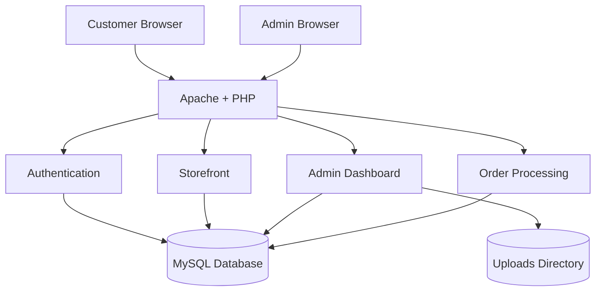

## Design Principles

- Shared helper layer in `components/app.php`
- Server-side validation for all sensitive operations
- Prepared SQL statements
- CSRF protection
- Shared security helpers centralize CSRF, session, and authentication logic
- Security-sensitive operations use reusable validation helpers instead of duplicated checks
- Progressive enhancement
- Mobile-first responsiveness for user-facing pages
- Security-first authentication flow

## 🗺️ Roadmap

This roadmap documents the project's evolution from the first public portfolio release through focused responsive, security, and production-readiness improvements.

### ✅ Version 1.0.0 — First Public Portfolio Release

- [x] Customer-facing cafe website
- [x] User authentication and profile management
- [x] Shopping cart and demo checkout
- [x] Order tracking
- [x] Admin dashboard
- [x] Product management
- [x] Customer contact management
- [x] Desktop-responsive interface
- [x] Live demo deployment
- [x] Playwright smoke tests
- [x] Portfolio-ready documentation
- [x] MIT License
- [x] Sanitized database schema

---

### ✅ Version 1.0.1 — Responsive UI Improvements

- [x] Improve mobile responsiveness across all pages
- [x] Fix remaining layout and spacing inconsistencies
- [x] Improve checkout forms on small screens
- [x] Optimize admin pages for tablets
- [x] Improve touch targets and mobile usability
- [x] Test common screen sizes (320px–1440px)

Completed responsive improvements:

- Customer mobile navbar, avatar dropdown, sticky behavior, and scroll-lock fixes
- Hidden mobile nav click-target fix after closing the hamburger menu
- Mobile menu reveal animation trigger fix
- Checkout GCash QR/payment image containment fix
- Profile notification touch-target improvement
- Admin mobile/tablet sidebar toggle with backdrop and keyboard close behavior
- Admin tables, cards, forms, and action controls responsiveness improvements
- Final responsive regression test across 320px–1440px

---

### ✅ Version 1.1.0 — Security & Authentication Hardening

- [x] CSRF protection across state-changing POST actions
- [x] POST-only logout with CSRF validation
- [x] Hardened session cookie settings
- [x] Conservative browser security headers
- [x] Shared password policy and server-side password validation
- [x] Session-based rate limiting for sensitive forms
- [x] Admin authorization refresh from the database
- [x] Admin role/delete safeguards
- [x] Expanded Playwright security/auth test coverage

Completed security/auth hardening:

- Shared CSRF helpers for token generation, hidden fields, validation, and safe rejection
- Secure session bootstrap with strict mode, cookie-only sessions, HttpOnly cookies, SameSite=Lax, and HTTPS-aware Secure cookies
- POST logout flow for customer and admin navigation
- Conservative global headers including `X-Content-Type-Options`, `X-Frame-Options`, `Referrer-Policy`, and `Permissions-Policy`
- Shared minimum password policy used by signup, customer password changes, and admin password changes
- Session-based throttling for login, signup, forgot-password demo, contact, and password-change attempts
- Admin role/status refresh from the database before admin authorization checks
- Transactional admin role/delete safeguards for self-demotion, self-delete, and last-admin protections
- Playwright regression tests for CSRF, logout, cookies, rate limiting, password policy, admin authorization, and admin user safeguards

This release improves the security baseline for a portfolio/demo application, but it should not be treated as fully production-ready security.

---

### 🧱 Version 1.2.0 — Data Integrity & Production Readiness Improvements

- [ ] Add database constraints and foreign keys
- [ ] Remove runtime schema creation and seeding
- [ ] Introduce migration workflow
- [ ] Harden upload validation
- [ ] Add CSP compatibility pass
- [ ] Improve GitHub Actions CI

---

### 💡 Future Improvements

- [ ] Email notifications
- [ ] Order analytics dashboard
- [ ] Advanced product search and filtering
- [ ] Customer reviews and ratings
- [ ] Performance optimization
- [ ] Accessibility improvements (WCAG)


## Author

Created by [JKCadilo14-CpE](https://github.com/JKCadilo14-CpE).

Licensed under the [MIT License](LICENSE).
