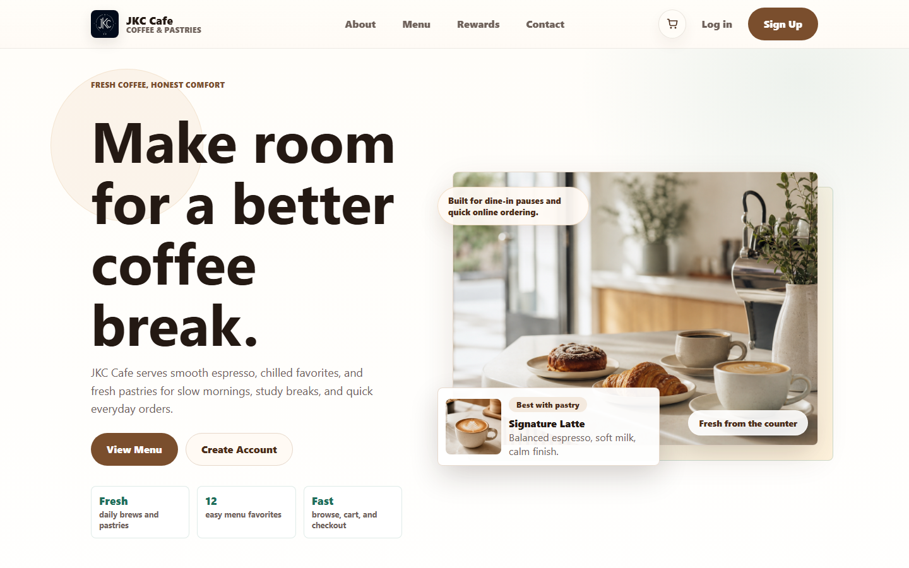

# JKC Cafe

[](http://cafedemotempsite.infinityfree.io/)


JKC Cafe is a full-stack cafe ordering portfolio project...
JKC Cafe is a full-stack cafe ordering portfolio project built with PHP and MySQL/MariaDB. It includes a customer-facing storefront for browsing products and placing demo orders, plus an admin dashboard for managing menu items, orders, users, and customer messages.

## Live Demo

Visit the public demo: [cafedemotempsite.infinityfree.io](http://cafedemotempsite.infinityfree.io/)

> The payment and password-recovery experiences are presentation-only demos. Do not enter real payment details or rely on this site for real transactions.

## Screenshots



## Features

### Customer experience

- Responsive homepage, menu, about, rewards, and contact pages
- Product search, category filtering, cart management, and order summary
- Account registration, login, profile, settings, and order tracking
- Demo checkout flows for cash on delivery, card, and GCash
- Product availability reminders and in-app notifications

### Admin experience

- Dashboard metrics and recent activity overview
- Product creation, editing, availability updates, and image uploads
- Order status management and customer-message review
- User administration, admin profile, and account settings

## Tech Stack

- PHP 8.2+
- MySQL 8+ or MariaDB 10.4+
- HTML, CSS, and vanilla JavaScript
- XAMPP for local Apache/MySQL development
- Playwright for browser smoke tests

## Local Setup

### Prerequisites

- XAMPP with Apache, PHP, and MySQL/MariaDB enabled
- Node.js 20+ and npm for Playwright tests

### 1. Clone and configure

```powershell
git clone https://github.com/JKCadilo14-CpE/cafe-website-demo.git
cd cafe-website-demo
Copy-Item config.example.php config.local.php
```

Update `config.local.php` with your local database name and credentials. This file is intentionally ignored by Git and must never be committed.

### 2. Create and import the database

Create an empty database named `jkc_cafe` (or choose another name and use it in `config.local.php`):

```sql
CREATE DATABASE jkc_cafe CHARACTER SET utf8mb4 COLLATE utf8mb4_unicode_ci;
```

Import the sanitized schema and safe catalogue seed data:

```powershell
mysql -u root -p jkc_cafe < database/schema.sql
```

### 3. Start the application

Place the project under XAMPP's `htdocs` directory, start Apache and MySQL from the XAMPP Control Panel, then open:

```text
http://localhost/Project/
```

The application creates ignored upload directories under `uploads/` when an image is uploaded. Ensure the web server can write to that directory in your local environment.

### 4. Create a local admin account

1. Create a regular account through the sign-up page.
2. In your local database, promote that account deliberately:

```sql
UPDATE users
SET role = 1
WHERE email = 'your-email@example.com';
```

Sign out and back in to load the admin role.

## Testing

Install the JavaScript test dependencies:

```powershell
npm ci
npx playwright install
```

With Apache, MySQL, and the local database configured, run the Chromium smoke tests:

```powershell
$env:BASE_URL = 'http://localhost/Project/'
npx playwright test --project=chromium
```

Run PHP syntax checks for all application files:

```powershell
Get-ChildItem -Recurse -Filter *.php | ForEach-Object { php -l $_.FullName }
```

## Deployment Notes

The live demo is hosted on InfinityFree. For a comparable deployment:

1. Create a MySQL/MariaDB database in the hosting dashboard.
2. Import `database/schema.sql` into that database.
3. Upload the application files, excluding `config.local.php`, `uploads/`, `node_modules/`, test reports, archives, and local backups.
4. Create `config.local.php` on the server from `config.example.php` and enter the host-provided credentials.
5. Confirm the server can write to `uploads/`.
6. Verify the customer pages, login/sign-up, demo checkout, and admin dashboard over HTTPS.

Never deploy real payment QR codes, credentials, customer records, password hashes, uploaded images, or database dumps.

## Repository Structure

```text
components/        Shared PHP application helpers and customer layout partials
admin pages/       Admin dashboard routes, styles, scripts, and partials
user-css/          Customer-facing stylesheets
user-js/           Customer-facing JavaScript
images/            Public visual assets
database/schema.sql Sanitized schema and safe product seed data
tests/             Playwright smoke tests
```

## Author

Created by [JKCadilo14-CpE](https://github.com/JKCadilo14-CpE).

Licensed under the [MIT License](LICENSE).
